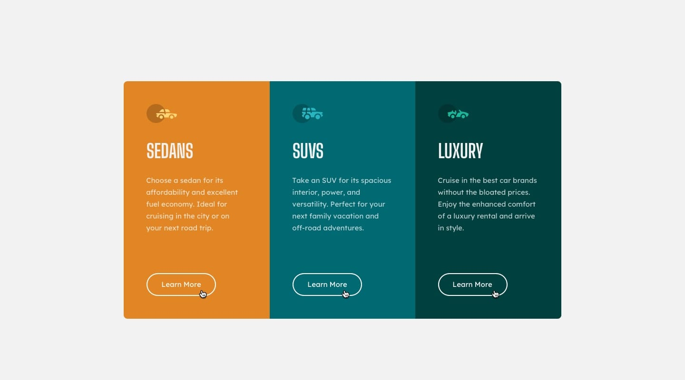

# Frontend Mentor - 3-column preview card component solution

This is a solution to the [3-column preview card component challenge on Frontend Mentor](https://www.frontendmentor.io/challenges/3column-preview-card-component-pH92eAR2-). Frontend Mentor challenges help you improve your coding skills by building realistic projects. 

## Table of contents

- [Overview](#overview)
  - [The challenge](#the-challenge)
  - [Screenshot](#screenshot)
  - [Links](#links)
- [My process](#my-process)
  - [Built with](#built-with)
  - [What I learned](#what-i-learned)
  - [Continued development](#continued-development)
  - [Useful resources](#useful-resources)
- [Author](#author)

## Overview

### The challenge

Users should be able to:

- View the optimal layout depending on their device's screen size
- See hover states for interactive elements

### Screenshot

### Links

- Solution URL: [Frontend Mentor Solution](https://www.frontendmentor.io/solutions/a-responsive-3-column-preview-card-component-Huvbm7gRzo)
- Live Site URL: [Github Live Site](https://saminstein.github.io/3-Column-Preview-Card-Component-/)

## My process

### Built with

- Semantic HTML5 markup
- CSS custom properties
- Flexbox
- CSS Grid
- Mobile-first workflow

### What I learned

- I learnt how to use grid view to divide a page into  3 columns

### Continued development

- I'd like to continue focusing on projects with responsive designs,and also to perfect CSS grid and flexbox techniques.

### Useful resources

- [W3 Schools](https://www.w3schools.com/css/css_rwd_grid.asp) - This is an amazing article which helped me on how to understand grid-view. I'd recommend it to anyone still learning this concept.

## Author

- Frontend Mentor - [@saminstein](https://www.frontendmentor.io/profile/saminstein)
- Twitter - [@saminsteins](https://www.twitter.com/saminsteins)
